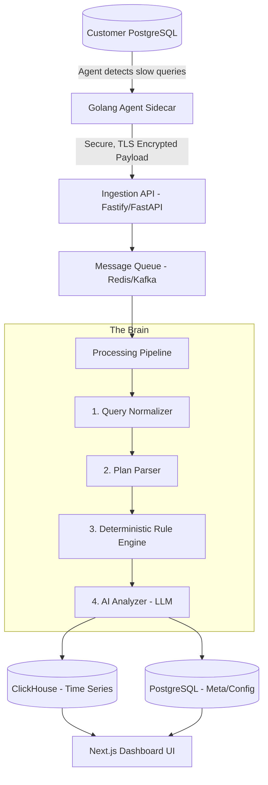

# 🚀 Product Specification: AI-Powered Database Query Debugger

## 📖 1. Executive Summary

**Product Vision**
To build the world’s most intuitive, actionable, and trusted database performance monitoring platform. We transform complex PostgreSQL execution plans into clear, human-readable insights with guaranteed accuracy, empowering developers of all skill levels to fix slow queries instantly without needing to become database experts.

**Mission Statement**
"Speed + clarity > completeness." APM tools like Datadog tell you *what* is slow. We tell you *why* it's slow and *exactly how to fix it*. No more staring at raw `EXPLAIN ANALYZE` outputs.

---

## 🎯 2. Target Audience & Problem Statement
yr2
### **Target Persona**
- Backend Engineers & Full-Stack Developers
- DevOps Engineers & Site Reliability Engineers (SREs)
- Startup CTOs

### **The Problem**
PostgreSQL is incredibly powerful, but understanding performance bottlenecks requires deep, specialized knowledge.
- Native `EXPLAIN ANALYZE` outputs are notoriously dense and intimidating.
- Existing generalist tools (Datadog, New Relic) offer generic metrics (CPU, Memory, Query Latency) but lack deep, actionable database intelligence.
- When production goes down due to a missing index or a sudden nested loop join, engineers panic and guess, leading to prolonged downtime.

### **The Solution**
A platform powered by a lightweight sidecar agent that automatically detects slow queries, applies deterministic DBA performance rules, and utilizes LLMs (AI) purely as a communication layer to explain the root cause and provide copy-pasteable SQL fixes.

---

## 💎 3. Core Differentiators ("Best-in-Class" Features)

To create a world-class platform, we must stand out in ways established incumbents cannot:

1.  **Zero-Friction, Safe Onboarding:** A 5-minute setup via a Golang binary or Docker sidecar. Crucially, the agent masks all PII and literal values *before* transmission.
2.  **Hybrid "AI + Rules" Engine (No Hallucinations):** 
    - AI goes rogue on raw data. We don't feed raw plans to AI. 
    - Instead, we run plans through a **Deterministic Rule Engine** (over 50+ hardcoded DBA rules) to find the issue (e.g., "Seq Scan with >90% rows filtered"). 
    - AI is *only* used to take the rule output and translate it into a friendly, clear explanation and specific SQL DDL.
3.  **One-Click Actionability:** Every detected bottleneck includes a "Fix It" module with the exact SQL command (e.g., `CREATE INDEX CONCURRENTLY idx_users_email ON users(email);`).
4.  **Specialized Focus:** Starting exclusively with PostgreSQL allows us to go *deeper* (understanding Vacuum states, TOAST bloat, CTE materialization) rather than going wide and shallow across 10 different databases.

---

## 🏗️ 4. System Architecture

*Referenced from `DESIGN.md`, expanded for enterprise scale.*

---

## 🛠️ 5. Technology Stack

### **Backend**
- **Framework:** Python FastAPI
- **Why:** High performance, natively asynchronous, and perfect for rapidly building robust data-ingestion APIs.

### **Frontend**
- **Framework:** ReactJS + Vite
- **Styling:** Tailwind CSS
- **Why:** Vite offers incredibly fast cold starts and HMR. React is the industry standard for rich interactive UIs (like execution plan trees). Tailwind CSS ensures modern, scalable, and best-in-class aesthetics without writing custom CSS.

---

## ⚙️ 6. Feature Requirements & Capabilities

### **5.1. The Agent (Data Collection)**
- **Mechanics:** Polls `pg_stat_statements` periodically (e.g., every 10s).
- **Trigger:** If query `mean_exec_time` > Threshold (e.g., 50ms), the agent actively runs `EXPLAIN (ANALYZE, FORMAT JSON)` on the normalized query footprint.
- **Safety:** Hard-capped to <1% CPU and <50MB RAM. Shuts itself down if boundaries are violated (Zero Risk to customer DB).
- **Data Scrubbing:** All query parameter values (strings, ints) are stripped locally. Only query structures and execution metadata are sent.

### **5.2. Processing Pipeline (The Brain)**
1.  **Query Normalizer:** Removes noise. `id = 1` and `id = 5` become `id = $1`.
2.  **Plan Parser:** Flattens deeply nested Postgres JSON into semantic nodes (Cost, Rows, Node Type, Buffers).
3.  **Rule Engine:** The core IP of the product. Needs to evaluate:
    - *Missing Indexes* (Seq Scan + Filter dropping many rows)
    - *Inefficient Joins* (Nested Loop on large row counts)
    - *Memory Spills* (Sort/Hash operations writing to disk instead of RAM)
4.  **AI Analyzer:** Given the triggered Rules and the JSON, formulate the output.
    - *Input Prompt:* "Rule 42 (Missing Index) triggered on table `users` column `org_id`. Produce a brief explanation and the DDL."

### **5.3. Frontend App (The Differentiator Layer)**
- **UX Paradigm:** Treat slow queries like "Inbox Zero". It's a triage queue, not just a dashboard of charts.
- **Query Ranking:** Sort the inbox by **"Total Time Impact"** (`avg_latency * frequency`). A 50ms query running 10,000 times/sec is worse than a 5-second query running once a day.
- **Incident View Pages:**
    - **Visual Plan Tree:** A beautifully rendered UI of the execution plan (flame graphs or node trees) that highlights the bottleneck node in red.
    - **The Diagnosis:** AI-generated 2-sentence summary.
    - **The Remedy:** Actionable SQL block with a "Copy to Clipboard" button.

---

## 🔒 7. Security, Privacy & Compliance

- **Least Privilege:** Agent only requires a strictly scoped read-only DB user.
- **Zero PII Leakage:** Data masking happens at the edge (in the Agent). No PII ever hits the Ingestion API.
- **Encryption:** TLS 1.3 for all data in transit. AES-256 for metadata at rest.
- **Deployment Models:** While SAAS is the primary model, the architecture is containerized to support future On-Premises/VPC deployments via Helm charts for enterprise clients.

---

## 🛣️ 8. Development Roadmap (MVP vs. V2)

### **Phase 1: MVP (Launch & Validate)**
- **Agent:** Basic Golang daemon reading `pg_stat_statements`.
- **Backend:** Python (FastAPI), Redis as Queue, PostgreSQL (for everything, ClickHouse skipped for V1 speed).
- **Rules:** Top 10 most common Postgres performance issues only.
- **UI:** Next.js Dashboard with the Query Inbox and AI Explanation views.
- **Goal:** Prove that the "Agent -> AI -> Explanation" loop delivers immediate "Aha!" moments.

### **Phase 2: Scale & Enrich (V2)**
- **Infrastructure:** Introduce ClickHouse for massive scale time-series data. Replace Redis with Kafka.
- **Integrations:** Slack/Discord alerts for sudden query regressions.
- **CI/CD:** GitHub App integration (e.g., auto-commenting on PRs if a migration will cause a slow query).
- **Rules Expansion:** Deep dives into locking, vacuum issues, and connection pooling bottlenecks.

---

## 📐 9. Success Metrics (KPIs)

To measure if we are truly "Best-in-Class":
1.  **Time-to-Value (TTV):** < 5 minutes from user signup to their first actionable AI insight.
2.  **Implementation Rate:** % of provided AI SQL fixes that users copy and execute (Target: >40%).
3.  **Agent Retention:** % of users who keep the agent running 30 days post-install.
4.  **System Overhead:** Must provably maintain < 1% CPU utilization on the customer's database host.
